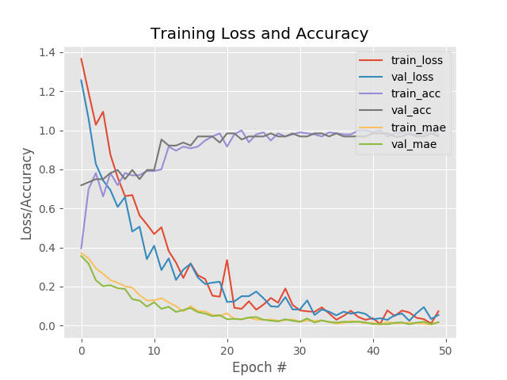

## Perception module

#### Traffic light detection
This module uses SSD (Single Shot MultiBox Detector) to detect traffic lights in the road images. We test with below 2 models (trained on COCO dataset and provided by Google's tensorflow team)
* [ssd_mobilenet_v1_coco](http://download.tensorflow.org/models/object_detection/ssd_mobilenet_v1_coco_2017_11_17.tar.gz)
* [ssd_inception_v2_coco](http://download.tensorflow.org/models/object_detection/ssd_inception_v2_coco_2017_11_17.tar.gz)

Try running the inference code with one of the following commands
```
cd scripts

# Test on some sample images from simulator
python tl_detector.py --image_dir ../data/sample/sim --viz

# Test on some sample images from site
python tl_detector.py --image_dir ../data/sample/site --viz

# Average time taken by ssd_inception_v2 model (no visualization)
python tl_detector.py --image_dir ../data/sample/sim --model ssd_inception_v2_coco_2017_11_17

# Average time taken by ssd_mobilenet_v1 model (no visualization)
python tl_detector.py --image_dir ../data/sample/sim --model ssd_mobilenet_v1_coco_2017_11_17
```

**Examples on simulation data**

Example 1            |  Example 2
:-------------------------:|:-------------------------:
 |  


**Examples on site data**

Example 1            |  Example 2
:-------------------------:|:-------------------------:
 |  

#### Traffic light classification (simulator)

This module assumes that we have the crop for traffic light (obtained from localization module) and we have to classify it in one of the following categories `['RED', 'YELLOW', 'GREEN', 'UNKNOWN']`.

Training data for this exercise is obtained from one of the pinned items in the slack channel `#s-t3-p-system-integra` (shared by See on November 21, 2017). We store a local copy of the data at `$(CarND-Capstone)/ros/src/tl_detector/light_classification/data`

Data statistics (number in braces corresponds to the label to integer mapping as mentioned in `styx_msgs/msg/TrafficLight.msg`)
* RED(0) - 337 images
* YELLOW(1) - 35 images
* GREEN(2) - 35 images
* UNKNOWN(4) - 6 images

**Model**
Our model is a vanilla CNN with three conv layers and one fully connected layer.

**Model Architecture**

|Layer (type)                 |Output Shape              |Param #   |
|-----------------------------|--------------------------|----------|
|conv2d_1 (Conv2D)            |(None, 32, 32, 32)        |896       |
|activation_1 (Activation)    |(None, 32, 32, 32)        |0         |
|max_pooling2d_1 (MaxPooling2 |(None, 16, 16, 32)        |0         |
|conv2d_2 (Conv2D)            |(None, 14, 14, 32)        |9248      |
|activation_2 (Activation)    |(None, 14, 14, 32)        |0         |
|max_pooling2d_2 (MaxPooling2 |(None, 7, 7, 32)          |0         |
|conv2d_3 (Conv2D)            |(None, 5, 5, 64)          |18496     |
|activation_3 (Activation)    |(None, 5, 5, 64)          |0         |
|max_pooling2d_3 (MaxPooling2 |(None, 2, 2, 64)          |0         |
|flatten_1 (Flatten)          |(None, 256)               |0         |
|dense_1 (Dense)              |(None, 64)                |16448     |
|activation_4 (Activation)    |(None, 64)                |0         |
|dropout_1 (Dropout)          |(None, 64)                |0         |
|dense_2 (Dense)              |(None, 4)                 |260       |
|activation_5 (Activation)    |(None, 4)                 |0         |

Total params: 45,348

Trainable params: 45,348

Non-trainable params: 0

**Model Training**



**Usage**
```
cd scripts

# Training
python tl_classifier.py train \
    --dataset ../data/tl_classifier_exceptsmall/simulator
    --model-dir ../models/classifier

# Inference
python tl_classifier.py test \
    --image ../data/tl_classifier_exceptsmall/simulator/Green/001176.png
    --model ../models/classifier
```


#### Traffic light classification (real)

Data statistics (number in braces corresponds to the label to integer mapping as mentioned in `styx_msgs/msg/TrafficLight.msg`)
* RED(0) - 271 images
* YELLOW(1) - 38 images
* GREEN(2) - 301 images
* UNKNOWN(4) - 19 images
